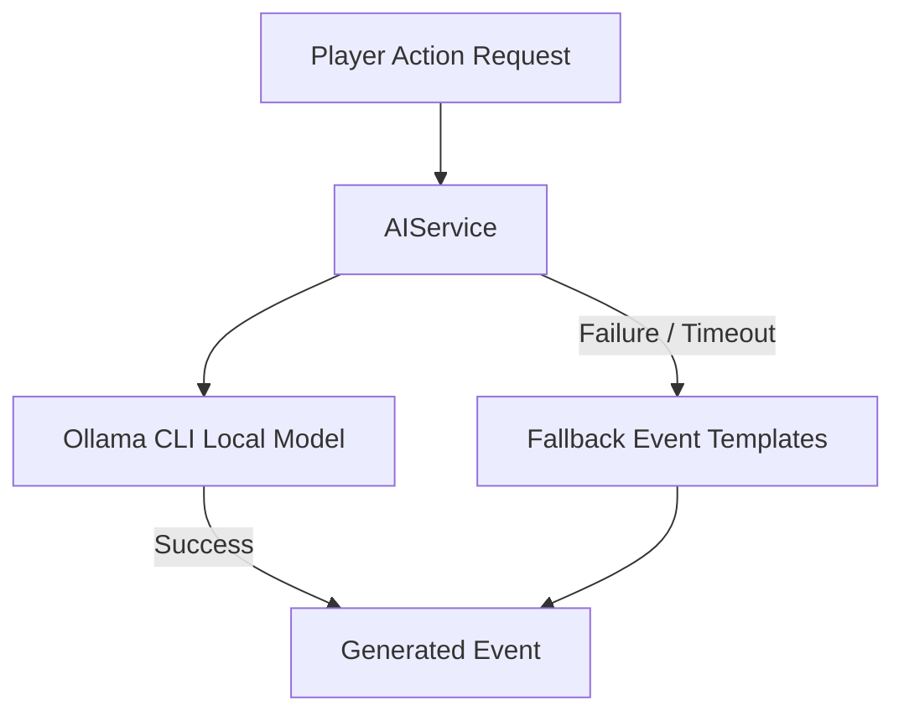
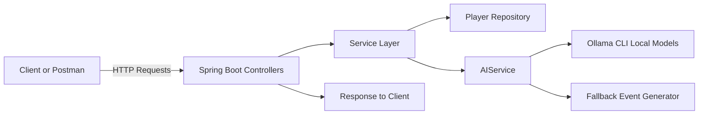

# Mini Metaverse Backend

**Mini Metaverse** is a **Java Spring Boot backend project** that simulates a mini virtual world where players can explore, interact, and fight in a dynamic environment. What sets it apart is its **system-level AI integration**: the backend uses locally hosted AI models (**Mistral**, **LLaMA2**) via **Ollama CLI** to generate real-time immersive responses for player actions, NPC behaviors, and world events. This demonstrates **offline AI capabilities** running directly on your system without cloud dependencies.

By combining **Spring Boot, PostgreSQL, WebFlux, and AI-driven event generation**, the project provides a robust, reactive backend ideal for interactive games, simulations, or metaverse-like experiences.

---

## Table of Contents

* [Features](#features)
* [Tech Stack](#tech-stack)
* [Setup](#setup)
* [Running the Project](#running-the-project)
* [API Endpoints](#api-endpoints)
* [AI Integration](#ai-integration)
* [System Architecture](#system-architecture)
* [Postman Collection](#postman-collection)
* [License](#license)

---

## Features

* Create and manage **Players** with inventories and health.
* Player actions: explore, move, attack, and more.
* Interact with **NPCs** with AI-generated behavior.
* Dynamically generate **world events** based on context.
* **System-level AI:** Local AI models generate text in real-time.
* Reactive endpoints via **Spring WebFlux** for non-blocking interactions.

---

## Tech Stack

* Java 17
* Spring Boot 3.5
* Spring Data JPA
* PostgreSQL
* Spring WebFlux (Reactive Programming)
* Ollama CLI for local AI models (`Mistral`, `LLaMA2`)
* Maven

---

## Setup

1. **Clone the repository**

```bash
git clone <repository-url>
cd mini-metaverse
```

2. **Configure PostgreSQL**

Update `application.properties`:

```properties
spring.datasource.url=jdbc:postgresql://localhost:5432/mini_metaverse
spring.datasource.username=postgres
spring.datasource.password=yourpassword
spring.jpa.hibernate.ddl-auto=update
```

3. **Install dependencies**

```bash
mvn clean install
```

4. **Install Ollama and download AI models**

```bash
brew install ollama
ollama pull mistral:latest
ollama pull llama2
```

---

## Running the Project

Start the Spring Boot application:

```bash
mvn spring-boot:run
```

Server will start at:

```
http://localhost:8080
```

---

## API Endpoints

### 1. Create Player

* **POST** `/players/create`
* **Request Body**:

```json
{
  "name": "Karan",
  "location": "village",
  "inventory": ["sword"]
}
```

* **Response**:

```json
{
  "id": 1,
  "name": "Karan",
  "location": "village",
  "health": 100,
  "inventory": ["sword"]
}
```

---

### 2. Player Action

* **POST** `/players/{id}/action?action={action}`
* **Example:** `/players/1/action?action=explore_cave`
* **Response:** AI-generated immersive event

```
Your exploration uncovers a crystalline formation that hums with power.
```

---

### 3. NPC Action

* **POST** `/npcs/{id}/act`
* **Example:** `/npcs/1/act`
* **Response:** AI-driven NPC behavior

```
NPC performs a mysterious ritual, empowering the nearby environment.
```

---

### 4. Generate World Event

* **POST** `/world/generateEvent?context={context}`
* **Example:** `/world/generateEvent?context=forest`
* **Response**:

```json
{
  "id": 1,
  "description": "A hidden grove emits a mystical glow as you enter the forest."
}
```

---

## AI Integration

* **System-level AI:** All AI responses are generated locally using **Ollama CLI**.
* Supported models: `mistral:latest`, `llama2`.
* AIService supports **synchronous and reactive** generation.
* Handles timeouts and fallback templates if AI is unavailable.
* Demonstrates **offline AI capabilities**, suitable for gaming, simulations, or metaverse environments.

---

## System Architecture

### AI Flow Diagram



### System Architecture Diagram



**Description:**
This architecture shows the complete flow of client requests to backend services, database persistence, and local AI model generation. All AI computations are performed **locally**, showcasing **system-level AI integration**.

---

## Postman Collection

Import the following Postman collection to test all endpoints:

```json
{
  "info": {
    "name": "Mini Metaverse API",
    "_postman_id": "12345-67890",
    "description": "Postman collection to test Mini Metaverse backend APIs",
    "schema": "https://schema.getpostman.com/json/collection/v2.1.0/collection.json"
  },
  "item": [
    {
      "name": "Create Player",
      "request": {
        "method": "POST",
        "header": [{"key":"Content-Type","value":"application/json"}],
        "url": {"raw":"http://localhost:8080/players/create","protocol":"http","host":["localhost"],"port":"8080","path":["players","create"]},
        "body": {"mode":"raw","raw":"{\n  \"name\": \"Karan\",\n  \"location\": \"village\",\n  \"inventory\": [\"sword\"]\n}"}
      }
    },
    {
      "name": "Player Action",
      "request": {
        "method": "POST",
        "url": {"raw":"http://localhost:8080/players/1/action?action=explore_cave","protocol":"http","host":["localhost"],"port":"8080","path":["players","1","action"],"query":[{"key":"action","value":"explore_cave"}]}
      }
    },
    {
      "name": "NPC Action",
      "request": {
        "method": "POST",
        "url": {"raw":"http://localhost:8080/npcs/1/act","protocol":"http","host":["localhost"],"port":"8080","path":["npcs","1","act"]}
      }
    },
    {
      "name": "Generate World Event",
      "request": {
        "method": "POST",
        "url": {"raw":"http://localhost:8080/world/generateEvent?context=forest","protocol":"http","host":["localhost"],"port":"8080","path":["world","generateEvent"],"query":[{"key":"context","value":"forest"}]}
      }
    }
  ]
}
```

---

## License
This project is licensed under the MIT License.

## Author

**Karan Sahani**  
Email: karansahani723@gmail.com  
GitHub: [https://github.com/karansahani78](https://github.com/karansahani78)  
LinkedIn: [https://www.linkedin.com/in/karansahani](https://www.linkedin.com/in/karan-sahani-70a0ba2b1/)  

This project was developed to showcase **system-level AI integration** in a Spring Boot backend for interactive metaverse experiences.

This project is licensed under the **MIT License**.

